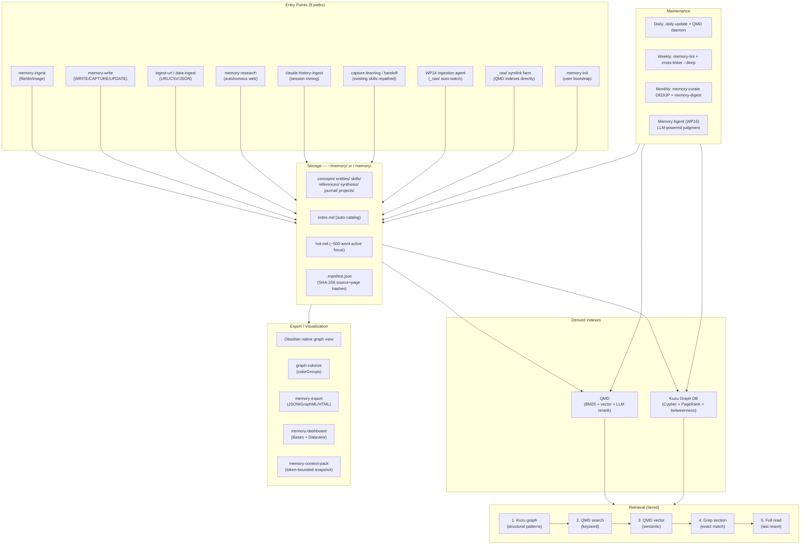
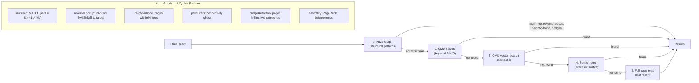
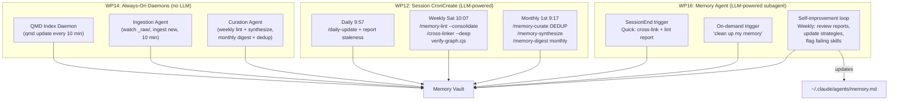

# LLM-Memory System — Architecture & Operations

**Date**: 2026-05-19
**Status**: Design complete (WP0-WP16 spec'd)

---

## 1. System Overview

The LLM-Memory system is a self-maintaining, graph-backed knowledge base stored as
an Obsidian-compatible Markdown vault. It ingests information from 9 distinct entry
points, stores it as typed pages with rich frontmatter and `[[wikilinks]]`, indexes
it with QMD (hybrid BM25+vector search) and Kuzu (embedded graph DB), and maintains
itself through autonomous agents and cron-driven housekeeping.

```
                          ┌──────────────────────────────┐
                          │     LLM-Memory System         │
                          │                              │
  Sources ──────────────> │  INGEST  ──>  STORE  ──>  RETRIEVE  │──> Answers
  Conversations          │    │           │           │         │
  URLs/Files             │    │     Markdown Vault        │
  Agent History          │    │     + Kuzu Graph          │
  Research               │    │     + QMD Index           │
                          │    │           │              │
                          │    ▼           ▼              │
                          │  MAINTAIN ──────────────> EXPORT  │──> Obsidian
                          │  (agents + cron)          (JSON/GraphML)
                          └──────────────────────────────┘
```

## 2. Information Flow



## 3. Vault Structure

```
~/memory/                              ← Global vault (~/.claude/memory → symlink)
├── index.md                           ← Auto-generated catalog (from all page frontmatter)
├── hot.md                             ← Active-focus snapshot (≤500 words, regenerated daily)
├── log.md                             ← Session activity log
├── USER.md                            ← User identity (fallback if hot.md missing)
├── GLOSSARY.md                        ← Controlled vocabulary
├── .manifest.json                     ← SHA-256 hashes per source + page
├── .kuzu/                             ← Kuzu embedded graph DB (derived, git-ignored)
├── .obsidian/                         ← Obsidian config (independent per vault)
│
├── concepts/                          ← Abstract ideas, design patterns, terminology
├── entities/                          ← People, projects, tools, organizations
├── skills/                            ← Skill documentation and usage patterns
├── references/                        ← External sources, URLs, papers
├── synthesis/                         ← Cross-topic connections, insights
├── journal/                           ← Daily/weekly digests
├── projects/                          ← Curated per-project overviews
│
├── _raw/                              ← Immutable source material
│   ├── plans/ → ~/.claude/plans/      ← Symlink: design docs become searchable
│   └── projects/<name>/ → <repo>/.memory/  ← Symlink: project vaults indexed here
├── _archive/                          ← Stale/deprecated pages (moved by memory-curate)
├── _staging/                          ← Review-before-publish holding area
├── _meta/                             ← Runtime state
│   ├── qmd-collections.json           ← Multi-collection QMD config
│   ├── budget.json                    ← Agent token/cost tracking
│   ├── agent-reports/                 ← Memory Agent task reports
│   └── .qmd-last-refresh              ← Daemon/hook coordination timestamp
│
└── <repo>/.memory/                    ← Per-project vault (mirrors global structure)
    ├── index.md, hot.md, .manifest.json
    ├── concepts/ entities/ ... 
    ├── .kuzu/ .obsidian/
    └── _raw/ _archive/ _staging/ _meta/
```

## 4. Page Frontmatter Schema

Every memory page carries this frontmatter (defined by WP2 `llm-memory`):

```yaml
---
title: "Page Title"
category: concepts|entities|skills|references|synthesis|journal|projects
tags: [2-5 from controlled taxonomy]
sources: ["source-identifier"]
created: 2026-05-19
updated: 2026-05-19
summary: >-
  One to two sentence summary, ≤200 chars.

# Provenance & Confidence
provenance: extracted|inferred|ambiguous
base_confidence: 0.0-1.0

# Lifecycle
lifecycle: draft|compiled|reviewed|verified|disputed|archived
lifecycle_changed: 2026-05-19
tier: pillar|core|supporting|peripheral

# Identity
aliases: ["alternate names"]

# Connections
relationships:
  - type: extends|implements|contradicts|derived_from|uses|replaces|related_to
    target: "[[Other Page]]"
---
```

## 5. Complete Skill Catalog

### Core Infrastructure (MVP: WP0-WP5)

| Skill | WP | Purpose | Triggers |
|-------|-----|---------|----------|
| (framework scaffold) | WP0 | Git repo, setup.sh, Makefile, agent configs, symlink farm | `setup.sh` |
| (vault migration) | WP1 | Move `~/.claude/.memory/` → `~/memory/`, QMD re-registration | (one-time) |
| `llm-memory` | WP2 | Schema theory: categories, frontmatter, retrieval protocol, scope rule | `/llm-memory` |
| `memory-init` | WP3 | Scaffold global/project vault, hooks, cron, symlinks, idempotent | `/memory-init --global`, `--project` |
| `memory-ingest` | WP4 | Source-to-page distillation, two-hash manifest, append-mode idempotency | "add this to my memory", "ingest this" |
| `memory-query` | WP4 | Tiered retrieval: Kuzu → QMD search → vector → grep → read | "what do I know about X", "search my memory" |
| `daily-update` | WP4 | Refresh hot.md, rebuild index.md, flag stale sources | `/daily-update`, "morning sync" |
| Kuzu sync | WP4 | Parse MD → graph nodes/edges, 6 Cypher query patterns | (hook-driven: SessionStart/SessionEnd) |
| `memory-lint` | WP5 | 13-issue audit; `--consolidate` auto-fixes safe issues | "audit my notes", "memory health check" |
| `memory-status` | WP5 | Source↔vault delta, token footprint, hub/bridge insights | "what's the status", "show me the delta" |
| `cross-linker` | WP5 | Unlinked-mention → wikilink; `--deep`: emergent entity detection | "link my pages", "connect my memory" |

### Lifecycle Operations (Phase 2b: WP6-WP8)

| Skill | WP | Purpose | Triggers |
|-------|-----|---------|----------|
| `memory-write` | WP6 | 3-mode: WRITE (save fact), CAPTURE (conversation→note), UPDATE (git-delta sync) | "remember this", "note that" |
| `memory-curate` | WP7 | 4-mode: CORE (distill→prune→merge), REBUILD, DEDUP, STAGE | "dedup my memory", "rebuild from archive" |
| `memory-synthesize` | WP8 | Co-occurrence matrix → synthesis pages connecting concepts | "synthesize my memory", "find connections" |
| `memory-digest` | WP8 | Daily/weekly/monthly knowledge summaries | `/memory-digest daily` |
| `tag-taxonomy` | WP8 | Controlled vocabulary: audit, normalize, add tags | "audit my tags" |
| `memory-research` | WP8 | 3-round autonomous web research, self-filed | "research X and save to memory" |
| `ingest-url` | WP8 | URL fetch → memory page with confidence from URL quality | "save this URL to memory" |
| `data-ingest` | WP8 | Universal handler: JSON/CSV/chat/HTML/images → memory pages | "import this data" |

### History & Visualization (Phase 2b: WP9-WP10)

| Skill | WP | Purpose | Triggers |
|-------|-----|---------|----------|
| `memory-history-ingest` | WP9 | Router dispatching to per-agent handlers | `/memory-history-ingest` |
| `claude-history-ingest` | WP9 | Mine Claude session history from JSONL + desktop app | "mine my conversations" |
| `memory-history-search` | WP9 | Query-driven targeted search across agent histories | `/memory-claude [query]` |
| `graph-colorize` | WP10 | Obsidian graph.json colorGroups, 5 modes | "color my graph" |
| `memory-export` | WP10 | JSON/GraphML/Neo4j/HTML export | "export my memory" |
| `memory-dashboard` | WP10 | Obsidian Bases + Dataview queries | "show my dashboard" |
| `memory-bridge` | WP10 | Browse/search/diff/map by source_type | "browse by source" |
| `memory-context-pack` | WP10 | Token-bounded context snapshots | "create context pack" |

### Integration & Automation (Phase 2b: WP11-WP16)

| Skill / Component | WP | Purpose |
|-------------------|-----|---------|
| `capture-learning` | WP11 | Existing skill repathed to memory vault + memory frontmatter |
| `handoff` | WP11 | Existing skill repathed to `.memory/handoffs/` |
| `grill-with-memory` | WP11 | Upgraded frontmatter output for memory compatibility |
| `repo-governance` | WP11 | Wikilink scan for stale links in `.memory/` |
| CronCreate (3 jobs) | WP12 | Daily daily-update, weekly memory-lint, monthly memory-digest |
| Framework finalization | WP13 | README, AGENTS.md, CI, secrets scan, v1.0.0 tag |
| Upkeep daemons (3-layer) | WP14 | QMD daemon (10min), ingestion agent (10min), curation agent (weekly/monthly) |
| E2E verification | WP15 | Full pipeline test, migration guide, skill-stocktake |
| Memory Agent | WP16 | Claude Code subagent: LLM-powered autonomous maintenance, self-improving |

### Deferred / Dropped

| Original skill | Disposition | Reason |
|----------------|-------------|--------|
| codex/copilot/hermes/openclaw-history-ingest | Deferred | No data sources on this machine |
| impl-validator | Deferred (2b review) | Value unclear for our use case |
| memory-switch | Dropped | Scope auto-discovery rule (WP2) replaces it |
| obsidian-memory-ingest | Dropped | memory-init (WP3) covers bootstrap equivalent |

## 6. Retrieval Architecture



**SessionStart injection** (separate from query-time retrieval):
- Loads `index.md` + `hot.md` from global and project vaults
- Total ≤2,500 tokens, project-overrides-global
- `<memory-context>` wrapper with data-not-instructions framing
- Frozen snapshot: mid-session writes take effect next session

## 7. Autonomous Maintenance



**Safety guarantees:**
- All agents report-only by default; writes require explicit `--consolidate` or user confirmation
- Budget controls: `max_daily_tokens` + `max_monthly_cost_usd` per agent
- Queue-with-backoff: offline LLM → queue work, retry with exponential backoff
- Dry-run preview before any destructive operation

## 8. Hook Architecture

```
SessionStart                      SessionEnd
    │                                  │
    ├─ qmd-refresh.cjs (if stale)      ├─ qmd-refresh.cjs --force
    ├─ sync-graph.cjs (if stale)       ├─ sync-graph.cjs --force
    ├─ Load: index.md + hot.md         ├─ Memory Agent spawn (if enabled)
    │   (global + project)             │   └─ Quick housekeeping
    │   ≤2,500 tokens                  │      (cross-link + lint report)
    └─ Inject: <memory-context>        └─ async, 30s timeout
```

**Coordination between hooks and daemons (AF-5):**
- Daemon writes `_meta/.qmd-last-refresh` timestamp atomically
- SessionStart hook reads timestamp — if daemon refreshed <10 min ago, skips own refresh
- No race condition: daemon is the only writer, hook is read-only

## 9. Multi-Agent Support

The framework supports 12 agent platforms via a symlink farm. `setup.sh` creates:

| Agent | Bootstrap | Skill Discovery | Scope |
|-------|-----------|-----------------|-------|
| Claude Code | `CLAUDE.md` | `.claude/skills/` → framework `.skills/` | Both |
| Cursor | `.cursor/rules/llm-memory.mdc` | `.cursor/skills/` | Project |
| Windsurf | `.windsurf/rules/llm-memory.md` | `.windsurf/skills/` | Project |
| Gemini CLI | `GEMINI.md` | `~/.gemini/skills/` (all 24) | Global |
| Codex | `AGENTS.md` | `~/.codex/skills/` (all 24) | Global |
| Antigravity | `GEMINI.md` + `.agent/rules/` | `~/.gemini/antigravity/skills/` | Both |
| Kiro | `.kiro/steering/llm-memory.md` | `.kiro/skills/` + `~/.kiro/skills/` | Both |
| OpenClaw | `AGENTS.md` | `~/.openclaw/skills/` + `~/.agents/skills/` | Both |
| + 4 more | (Copilot, Trae, Hermes, Generic) | Per-agent symlinks | Varies |

**Portable skills** (4, installed globally): `memory-init`, `memory-write`, `memory-query`, `memory-update`
**Vault-scoped skills** (20, available when CWD is in a vault): all ingest/lint/synthesize/graph/export skills

## 10. Verification Architecture

Every work package ships with deterministic verification scripts. Total: 25+ scripts across 16 WPs.

```mermaid
flowchart LR
    subgraph PerSkill["Per-Skill Verification"]
        V1["verify-ingest.sh\n(source → page + frontmatter)"]
        V2["verify-query.sh\n(tiered retrieval)"]
        V3["verify-lint.sh\n(13 issue types)"]
        V4["verify-cross-link.sh\n(wikilink insertion)"]
        V5["verify-graph.cjs\n(6 Cypher patterns)"]
    end

    subgraph Integration["Integration Verification"]
        V6["verify-memory-init.cjs\n(idempotent scaffold + hooks)"]
        V7["verify-daemon.sh\n(systemd timers + ingestion E2E)"]
        V8["verify-setup.sh\n(idempotent setup.sh)"]
    end

    subgraph E2E["End-to-End"]
        V9["verify-e2e.sh\n(ingest→query→lint→cross-link→synthesize→digest)"]
        V10["verify-memory-agent.sh\n(agent housekeeping + self-improvement)"]
    end

    PerSkill --> Integration --> E2E
    E2E -->|"make verify"| Pass["✓ All green"]
```



**Improvement loop pattern (every verify script):**
1. BASELINE: measure before change
2. CHANGE: apply skill/workflow
3. VERIFY: run script → pass/fail
4. COMPARE: diff baseline → regression or improvement?
5. REPORT: write to `_meta/improvement-log.json`

## 11. Global ↔ Project Scope

```
Query/Writes resolve scope via CWD:
  ┌─ Inside a git repo with .memory/ → project scope (wins on conflict)
  └─ Otherwise → global scope (~/memory/)

Hybrid D bridge:
  ~/memory/_raw/projects/<name>/ → symlink → <repo>/.memory/
  ├─ QMD indexes everything through _raw/ symlinks
  ├─ Project vault content is searchable from global vault
  └─ Curated overview pages at ~/memory/projects/<name>/
```

## 12. Key Design Decisions Reference

| Decision | Rationale |
|----------|-----------|
| Markdown as source of truth | Git version control, Obsidian visualization, human readability |
| Kuzu embedded graph DB | Local, no server, Cypher + graph algorithms, single npm dep |
| QMD for semantic search | Local GGUF models, BM25+vector+LLM rerank, no API calls |
| `~/memory/` canonical path | Accessible by all agents; `~/.claude/.memory/` → symlink |
| SessionStart frozen snapshot | ≤2,500 tokens, preserves prefix cache, mid-session writes effective next session |
| WP14 daemons + WP16 agent | Daemons: deterministic, no-LLM. Agent: LLM-powered judgment for ambiguous cases |
| Append-mode default for ingest | Never overwrite human edits; `--full` opt-in for overwrite |
| Report-only default for maintenance | `--consolidate` flag required for writes; dry-run preview always shown |
